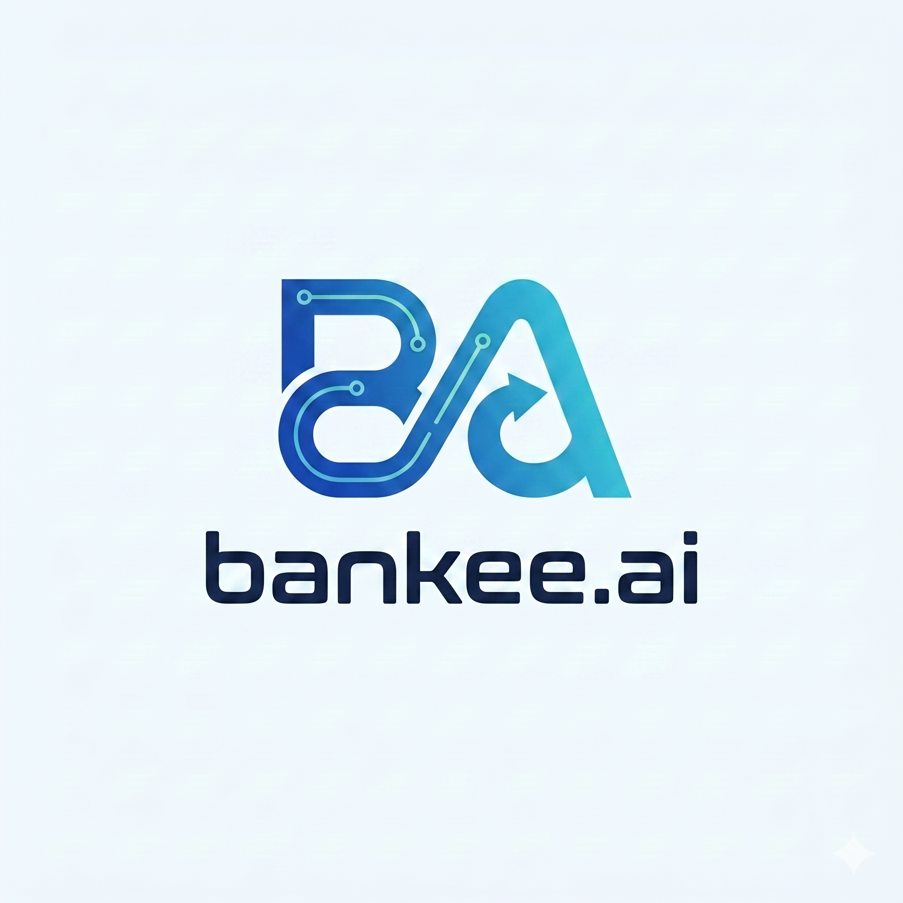

# Bankee SDK

> Connect any smart device to every major payment network via a single integration.

The Bankee SDK abstracts the complexity of multi-rail payment infrastructure, giving device manufacturers one elegant integration that unlocks Wero, Open Banking, Agentic Protocols, Stablecoins, CBDCs, and traditional cards simultaneously.

## Supported Payment Rails

| Protocol | Status | Description |
|----------|--------|-------------|
| Wero / APMs | ✅ Live | European instant payments, 43M+ users |
| Open Banking | ✅ Live | A2A transfers via 2,000+ banks (Yapily) |
| Visa / Mastercard | ✅ Live | Traditional card networks |
| Google AP2 | ✅ Integrated | Agent Payments Protocol |
| Coinbase x402 | ✅ Integrated | HTTP-native machine payments |
| Stripe MPP | ✅ Integrated | Machine Payments Protocol |
| OpenAI ACP | ✅ Integrated | Agentic Commerce Protocol |
| A2A | ✅ Integrated | Agent-to-Agent communication |
| Digital Euro (CBDC) | 🗺 Roadmap | Central Bank Digital Currency |

## Installation

```bash
npm install @bankee/sdk
# or
yarn add @bankee/sdk
```

## Quick Start

```typescript
import { BankeeSDK } from '@bankee/sdk';

const bankee = new BankeeSDK({
  apiKey: process.env.BANKEE_API_KEY,
  environment: 'production', // or 'sandbox'
});

// Accept a payment via any available rail
const payment = await bankee.payments.create({
  amount: 1000, // in minor units (£10.00)
  currency: 'GBP',
  rails: ['wero', 'open_banking', 'card'], // preference order
  device: {
    type: 'wearable',
    nfc: true,
    secureElement: true,
  },
});
```

## Agentic Payments

```typescript
import { BankeeSDK, AgentPayment } from '@bankee/sdk';

const bankee = new BankeeSDK({ apiKey: process.env.BANKEE_API_KEY });

// Configure an AI agent to trigger payments autonomously
const agentPayment = await bankee.agentic.createPayment({
  protocol: 'ap2',       // Google AP2, x402, mpp, or acp
  amount: 500,
  currency: 'USDC',
  approval: 'auto',      // or 'human-in-loop'
  agent: {
    id: 'inventory-agent-01',
    capabilities: ['initiate_payment', 'negotiate_price'],
  },
});
```

## Architecture

```
┌─────────────────────────────────────────────────┐
│                  Your Application                │
└─────────────────────┬───────────────────────────┘
                      │
┌─────────────────────▼───────────────────────────┐
│                  Bankee SDK                      │
│  ┌──────────┐ ┌──────────┐ ┌──────────────────┐ │
│  │  Device  │ │ Payment  │ │    Agentic       │ │
│  │ Manager  │ │  Router  │ │    Gateway       │ │
│  └──────────┘ └──────────┘ └──────────────────┘ │
└─────────────────────┬───────────────────────────┘
                      │
        ┌─────────────┼─────────────┐
        │             │             │
   ┌────▼────┐  ┌─────▼────┐  ┌────▼──────┐
   │  Wero   │  │   Open   │  │  Agentic  │
   │  Cards  │  │ Banking  │  │ Protocols │
   └─────────┘  └──────────┘  └───────────┘
```

## Device Support

- **NFC** — contactless payments on any NFC-enabled device
- **BLE** — Bluetooth Low Energy for proximity payments
- **Secure Element** — hardware-backed key storage and cryptographic operations
- **APDU** — Application Protocol Data Unit handling for EMV compliance

Supported form factors: phones, smartwatches, wearables, smart rings, IoT devices, any NFC-capable hardware.

## Protocol Integrations

See [`bankee-ai/protocol-integrations`](https://github.com/bankee-ai/protocol-integrations) for reference implementations and guides for each supported protocol.

## Compliance

- PSD2 / PSD3 compliant
- GDPR compliant
- EMV Level 1 & 2 certified
- Authorised via Yapily (FCA registered)
- Bank-level AES-256 encryption

## Documentation

Full documentation, API reference, and integration guides: [docs.bankee.ai](https://bankee.ai)

## Support

- **Integration support**: mohammed@bankee.ai
- **Commercial enquiries**: Jonathan@bankee.ai
- **Partnership**: naved@bankee.ai

## License

Proprietary — © 2025 Bankee Payment Solutions Ltd. SDK reference implementations in `/examples` are MIT licensed.
